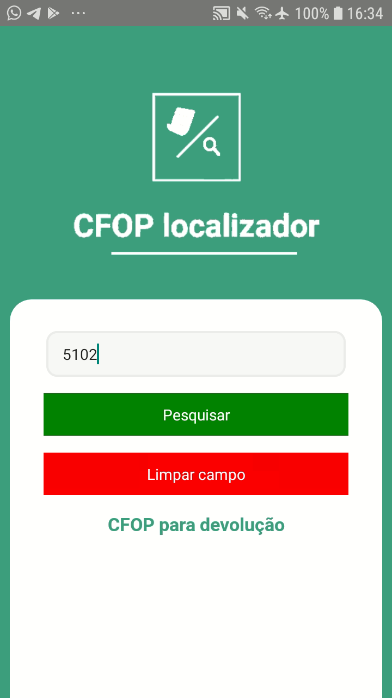
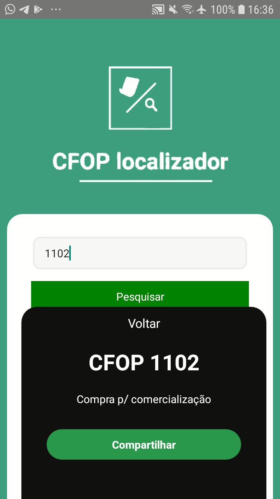

# CfopLocalizador

Projeto de um aplicativo mobile para localizar cfop (código fiscal de operações e prestações), o aplicativo consulta os dados solicitados pelo usuário na <a href="https://github.com/cesar99144/ApiCFOP-Laravel" target="_blank">api</a>. 

<h3>Foi utilizado:</h3>
<ul>
    <li>React native Cli - versão 0.64.2</li>  
    <li>Axios para as requisições HTTP</li>  
   
</ul>

<h3>Requisitos instalação:</h3>
    <blockquote>
       React native instalado 
       Npm do node para caso precise rodar algum pacote 
       É fundamental que a <a href="https://github.com/cesar99144/ApiCFOP-Laravel" target="_blank">api</a> do projeto esteja instalada em seu computador rodando no localhost:3030. Caso queira rodar a api em outra porta, altere a url do localhost na pasta <code>src\services\api.js</code>
    </blockquote>

<h3>Instalação: </h3>
<blockquote>
    clonar este repositório para um diretório de sua preferência 
    
</blockquote>
    <ul>
      <li> Navegar até a pasta do projeto e executar <code>npx react-native run-android</code></li>  
      <li> Se tudo ocorrer bem o aplicativo já será iniciado de imediato</li>  
    </ul>

<h3>Possíveis erros ao executar a consulta: </h3>
<blockquote>
    <code>Network error</code> - Esse erro se da devido a porta em que a api está sendo executada, como ela está em localhost é muito comum que ela não fique acessível para o dispositivo em que pretende executar o projeto, seja um emulador ou seu próprio aparelho.
    
</blockquote>

<h3>Algumas imagens do projeto: </h3>

 
 